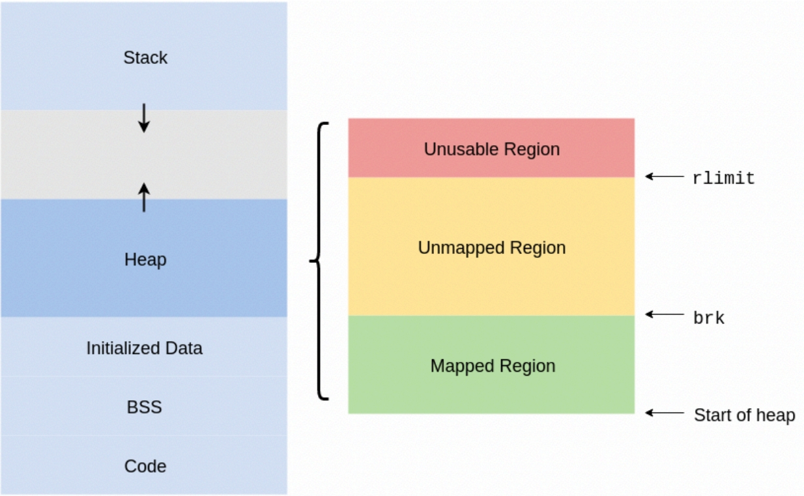
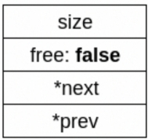
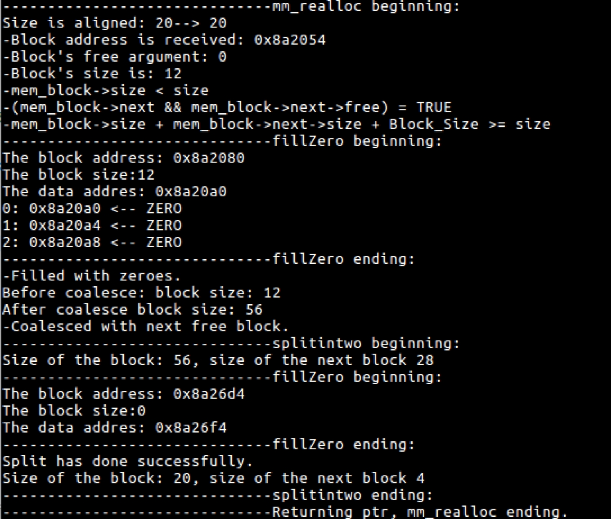
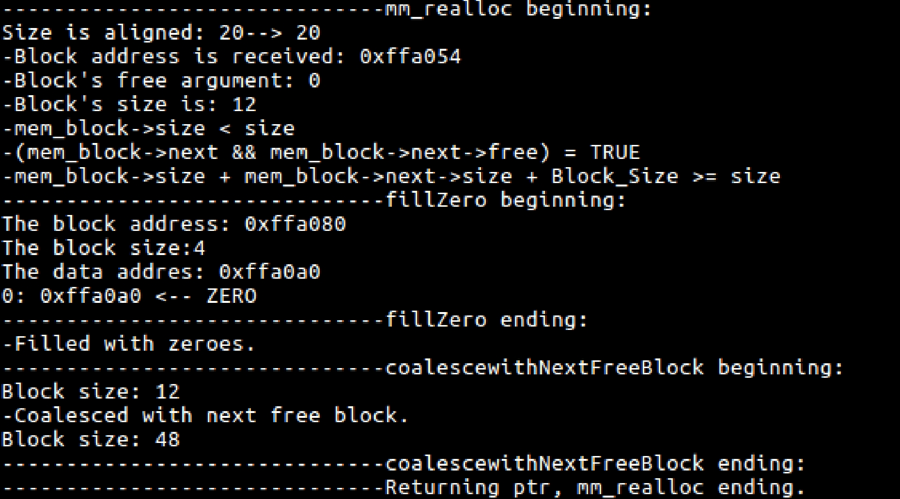
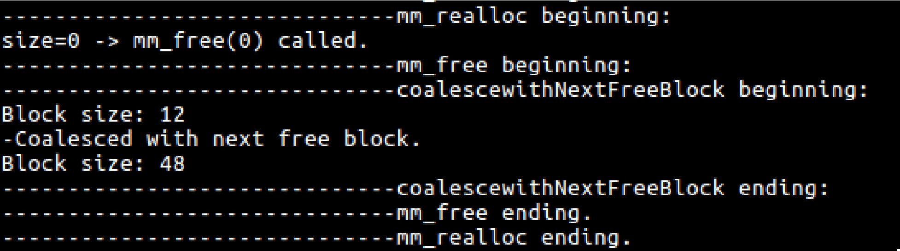
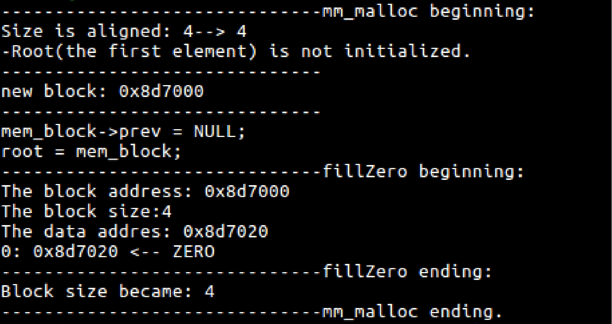
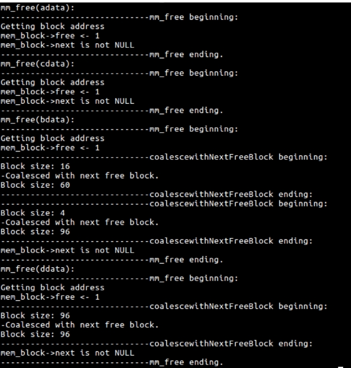

# C Memory Allocations From Scratch
We use malloc, realloc and free functions in ``<stdlib.h>`` C library everywhere when we write C code. They are, simply, used in order to partition the memory and give the appropriate place which we can use. We use these functions but don't know what's inside them and what kind of process included in these functions.

The aim of this project is to find out how memory allocation transactions really work. When some process is running, operating system gives user an area to use. But operating system doesn't define what kind of data structure will be used in this area or what kind of searching algorithm will be managed. This area is so-called heap. Each process has its own virtual address space and these virtual adresses linked to physical memory. Operating system links the virtual addresses to physical adresses. Heap area is in fact not monolithic and contains 3 parts: unusable region, unmapped region and mapped region.

Heap and the other parts of the memory is shown below:



Malloc, realloc and free functions use the mapped region and move the break(brk) appropriately in the mapped region expansion.


## Data Structure
In this implementation, a classic linked list data structure is used. Data structure each element points to the next element in linked list. Since it is a double linked list, each element points to the previous element. Additionally, each block has a ``free`` parameter indicating whether this block is free or not. Finally, we can build a header structure shown in below:



For each block, we include the following metadata:
	- **prev, next** : pointers to metadata describing the adjacent blocks
	- **free** : a boolean describing whether or not this block is free
	- **size** : the allocated size of the block of memory

In C, we can implement it as:

```c
typedef struct MEM_Block *Block_Ptr;

struct MEM_Block {
	size_t size;
	int free;
	Block_Ptr next;
	Block_Ptr prev;
}
```


## Implementation Details
A struct, as a data structure, is defined in the previous section. On top of that, 3 functions have been implemented, namely malloc, realloc, and free. The implementation of these functions and which operations they contain are shown below.

### 1. ``void *mm_malloc(size_t size)``
* If size is equal to zero return NULL.
* Align the requested size to four.
* If root(the first element) is initialized:
    - Find a free block with first fit algorithm
    - If we found one:
        - If this block's size >= requested size + block size + 4(Minimum Unit Size): Split the block
        - Make the free parameter as 0.
    - If not found:
	    - Create more space and a block.
	    - If more space cannot be created return NULL.
* If root(the first element) is NOT initialized:
	- Create more space and a block
	- If more space cannot be created return NULL.
	- Make new block's previous parameter NULL
	- Assign new block's address to the root address.
* Fill the block with zero.
* Return header address + block size (i.e. the address of the chunk of the free memory)

### 2. ``void *mm_realloc(void *ptr, size_t size)``
* If ptr is NULL:
    - Call mm_malloc(size).
    - Return the return value of the mm_malloc.
* If ptr is not NULL and size = 0:
    - Call mm_free(ptr).
    - Return NULL.
* Align the requested size to four.
* If block's size >= requested size:
    - If this block can be split, split in two.
    - Return the parameter ptr.
* mem_block->size < requested size:
    - If next block is not null and next block is free:
        - if current block size + next block size + block size >= requested size:
            - Fill the next block with zero.
            - Coalesce with next free block.
            - If this block's size >= requested size + block size + 4(Minimum Unit Size): Split the block.
    - If next block is null or next block is not free:
        - Call mm_malloc(size), If mm_malloc return value is NULL, then return NULL
        - Get reallocated block address.
        - Call mm_free(ptr) in order to free the old block
        - Call memcpy(adr_reallocedBlock, ptr, oldSize) and return the adress of the reallocated block's data.

### 3.  ``void mm_free(void *ptr)``
* If ptr is NULL:
    - Do nothing.
* Get block address.
* Mark block's free as 1.
* If previous block is free and not NULL :
    - Coalesce previous block with this block.
* If next block is free and not NULL :
    - Coalesce this block with next block.
* If next block is NULL:
    - If previous block is NULL:
        - Assign root as NULL(i.e. this is the last block)
    - If previous block is not NULL:
        - Set previous block's next parameter as NULL.
    - Set break to the beginning of the block.

### 4. (Extra) **``mm_test.c``**
Contains code to load the implementation and a basic sanity check.

## Test Cases
Note that block size is equal to 32 in decimal and 10H in hexadecimal.

### Test Case #1: ``mm_realloc``
* Code:

	```c
	int *adata = (int*) mm_malloc(sizeof (int));
	long double *bdata = (long double*) mm_malloc(sizeof (long double));
	int *cdata = (int*) mm_malloc(sizeof (int) * 3);
	int *ddata = (int*) mm_malloc(sizeof (int) * 3);
	int *edata = (int*) mm_malloc(sizeof (int) * 7);
	int *fdata = (int*) mm_malloc(sizeof (int));
	
	mm_free(ddata);
	cdata = (int*) mm_realloc(cdata, sizeof (int) * 5);
	```

* Output:



### Test Case #2: ``mm_realloc``
* Code:

	```c
	int *adata = (int*) mm_malloc(sizeof (int));
	long double *bdata = (long double*) mm_malloc(sizeof (long double));
	int *cdata = (int*) mm_malloc(sizeof (int) * 3);
	int *ddata = (int*) mm_malloc(sizeof (int));
	int *edata = (int*) mm_malloc(sizeof (int) * 7);
	int *fdata = (int*) mm_malloc(sizeof (int));
	
	mm_free(ddata);
	cdata = (int*) mm_realloc(cdata, sizeof (int) * 5);
	```

* Output:



### Test Case #3: ``mm_realloc``
* Code:

	```c
	int *adata = (int*) mm_malloc(sizeof (int));
	long double *bdata = (long double*) mm_malloc(sizeof (long double));
	int *cdata = (int*) mm_malloc(sizeof (int) * 3);
	int *ddata = (int*) mm_malloc(sizeof (int));
	int *edata = (int*) mm_malloc(sizeof (int) * 7);
	int *fdata = (int*) mm_malloc(sizeof (int));
	
	mm_free(ddata);
	cdata = (int*) mm_realloc(cdata, 0);
	```

* Output:


### Test Case #4: ``mm_realloc``
* Code:

	```c
	int *adata = (int*) mm_malloc(0);
	```
	
* Output:


### Test Case #5: ``mm_realloc``
* Code:

	```c
	int *adata = (int*) mm_malloc(sizeof(int));
	```
	
* Output:



### Test Case #6: ``mm_realloc``
* Code:

	```c
	int *adata = (int*) mm_malloc(sizeof(int));
	long double *bdata = (long double*) mm_malloc(sizeof (long double));
	int *cdata = (int*) mm_malloc(sizeof (int) * 3);
	int *ddata = (int*) mm_malloc(sizeof (int) * 3);
	
	printf ("mm_free(adata):\n");
	mm_free(adata);
	printf ("mm_free(cdata):\n");
	mm_free(cdata);
	printf ("mm_free(bdata):\n");
	mm_free(bdata);
	printf ("mm_free(ddata):\n");
	mm_free(bdata);
	```

* Output:




## Conclusion
Memory allocation functions malloc, realloc, free can be implemented easily. There's lots of way to do it but one of the simplest method is using linked list as data structure and using first fitting algorithm for finding process. These functions seem very complicated at the first glance but they are not complicated at all and can be implemented by anyone who knows C-language. In the solution we use headers to identify the data stored in the specific address(es). Headers must be invisible to the user who uses these function. It means when user uses mm_realloc or mm_malloc the returned address must show the data address but not the head. So user may not think there is header before or not. User just requests the size and gets what s/he wants. Abstraction is the key of the solution. On the other hand, mm_free function doesn't release the memory except the specific cases(e.g. the block is the last block or there is just 1 block left). mm_free function's main job is mark the related block's free parameter as 1. So, it makes this data overwritable. When first fit algorithm trying to find the first appropriate data, it looks if free parameter of a block is zero or one. If free parameter is one then new data can be written the data of this block. As result, free function doesn't really release resource. Hence, we accomplished and solved the problem.

For more information, please visit [memory_allocation_background.pdf](./docs/memory_allocation_background.pdf).